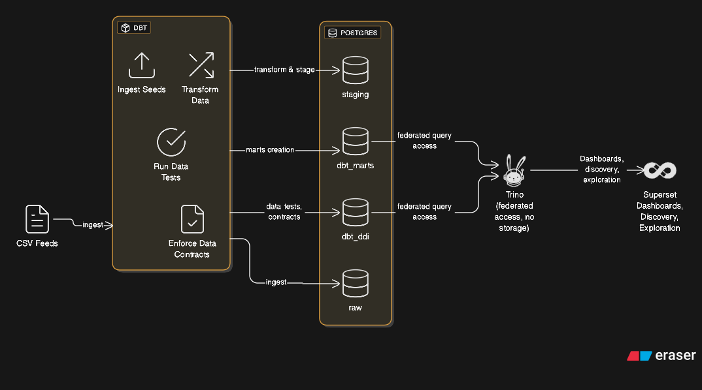

This repository explores how data contracts can be defined and enforced for the classic Jaffle Shop dbt demo.

Medium article with the original setup of dbt with a local postgres:
[Medium Link](https://medium.com/@snhou/running-the-jaffle-shop-dbt-project-in-seconds-47bf72363744)

Our setup is different from the original repo in that
- we use `uv` instead of `pip` [see why](https://medium.com/@sumakbn/uv-vs-pip-revolutionizing-python-package-management-576915e90f7e),
- `podman` instead of `Docker` [see why](https://medium.com/@sumakbn/uv-vs-pip-revolutionizing-python-package-management-576915e90f7e),
- Kilo Code VS Code extension with Grok,
- Apache Superset to browse Postgres data

This is a post in the series titled "Data Contracts with dbt"

[1/7: Why Data Contracts Matter](https://www.linkedin.com/feed/update/urn:li:activity:7367654714525642753/)

[2/7 Declaring Data Contracts in dbt](https://www.linkedin.com/feed/update/urn:li:activity:7369170884021964801/)

[3/7 Enforcing with Data Tests](https://www.linkedin.com/feed/update/urn:li:activity:7369463558130098178/)

[4/7 Documentation Matters](https://www.linkedin.com/feed/update/urn:li:activity:7370036803829063680/?updateEntityUrn=urn%3Ali%3Afs_feedUpdate%3A%28V2%2Curn%3Ali%3Aactivity%3A7370036803829063680%29)

[5/7 Tracking Data Consumers with dbt Exposures](https://www.linkedin.com/feed/update/urn:li:activity:7370761583909568512/?updateEntityUrn=urn%3Ali%3Afs_feedUpdate%3A%28V2%2Curn%3Ali%3Aactivity%3A7370761583909568512%29)

[6/7 Data Contracts, ELT, and the role of DBT](https://www.linkedin.com/feed/update/urn:li:activity:7371108866610126848/?updateEntityUrn=urn%3Ali%3Afs_feedUpdate%3A%28V2%2Curn%3Ali%3Aactivity%3A7371108866610126848%29)

[7/7 Digging into Failures with store_failures](https://www.linkedin.com/feed/update/urn:li:activity:7371856485129011201/?updateEntityUrn=urn%3Ali%3Afs_feedUpdate%3A%28V2%2Curn%3Ali%3Aactivity%3A7371856485129011201%29)

[8/7 Testing Data Contracts with datacontract.com CLI](https://www.linkedin.com/feed/update/urn:li:activity:7375296445676945408/?updateEntityUrn=urn%3Ali%3Afs_feedUpdate%3A%28V2%2Curn%3Ali%3Aactivity%3A7375296445676945408%29)

[9/7 𝐅𝐞𝐝𝐞𝐫𝐚𝐭𝐞𝐝 𝐀𝐜𝐜𝐞𝐬𝐬 𝐰𝐢𝐭𝐡 𝐓𝐫𝐢𝐧𝐨](https://www.linkedin.com/posts/yurychebiryak_datamesh-dbt-vibecoding-activity-7377590326426775552-ELRJ?utm_source=share&utm_medium=member_ios&rcm=ACoAAAEI_0oB7fYEPncLP2s2k_qPhBZeQS5RO7s)

[𝟏𝟎/𝟕 Testing Data Expectations in dbt](TBD)

(C) 2025 Chebiryak Consulting https://consulting.chebiryak.name/about-me/



## Prerequisites
1. git
2. Python 3.9 or higher


## Setup environment

1. Clone this repository
```bash
git clone https://github.com/YuryChebiryak/jaffle-shop-dbt-demo.git
```
2. Change into the `jaffle_shop` directory
```bash
cd jaffle-shop-dbt-demo
``` 

3. Install virtual environment
``` bash
python3 -m venv venv
```

4. Enter into venv
```bash
source venv/bin/activate
```

5. Update pip
```bash
python3 -m pip install --upgrade pip
```

6. Install uv
```bash
pip install uv
```

6. Install dependencies
```bash
uv pip install -r requirements.txt
```

7. Install dbt packages
```bash
dbt deps
```

7. Install podman, initialize it and start it

```bash
brew install podman
podman machine init
podman machine start
```

7. Run Podman
```bash
podman compose build
```
```bash
podman compose up -d
```

## Running this project

1. Set up a `profiles.yml` called `jaffle_shop` to connect to a data warehouse

```yaml
jaffle_shop:
  target: dev
  outputs:
    dev:
      type: postgres
      host: localhost
      user: dbt
      password: dbt
      port: 5432
      dbname: dbt
      schema: jaffle-shop-classic
      threads: 4
```

2. Ensure your profile is setup correctly from the command line:
```bash
dbt debug
```
* it will generate a `.user.yml` file
 
3. Load the CSVs with the demo data set. This materializes the CSVs as tables in your target schema. Note that a typical dbt project **does not require this step** since dbt assumes your raw data is already in your warehouse.
```bash
dbt seed
```

4. Run the models:
```bash
dbt run
```

*Note: The project uses tags to organize models by schema, allowing selective execution. For example, to run only models tagged with 'ddi' with debug logging:*

```bash
dbt run -s tag:ddi --log-level debug
```

5. Test the output of the models:
```bash
dbt test
```

6. Generate documentation for the project and persist to database:
```bash
dbt build
```
*Note: `dbt build` automatically includes `dbt docs generate` - it runs models, tests, generates docs, and persists documentation as database comments*

7. View documentation for the project with exposures and lineage:
```bash
dbt docs serve
```
*Note: The project includes exposures.yml defining dashboard dependencies for better lineage tracking*


## Apache Superset

Apache Superset is included in the docker-compose setup for data visualization and exploration.

### Accessing Superset

1. After running `podman compose up -d` or `docker-compose up -d`, Superset will be available at [http://localhost:8088](http://localhost:8088)

2. Default login credentials:
   - Username: `admin`
   - Password: `admin`

### Database Connection

The dbt database is automatically added as a data source during Superset initialization. You can immediately start creating charts and dashboards using the dbt-transformed data in the following schemas:

- **Main models**: `jaffle-shop-classic` schema (staging and marts models)
- **Analytics models**: `ddi` schema (rolling 30-day orders analysis)

If you need to manually add or modify database connections:
1. Log in to Superset with the admin credentials
2. Go to **Data** > **Databases** in the top menu
3. Click **+ Database**
4. Select **PostgreSQL** as the database type
5. Enter the following connection details:
   - **Host**: `postgres`
   - **Port**: `5432`
   - **Database Name**: `dbt`
   - **Username**: `dbt`
   - **Password**: `dbt`
6. Click **Test Connection** to verify
7. Click **Add** to save the database

## Data-Driven Insights (DDI) Schema

The project includes a dedicated `ddi` schema for advanced analytics and insights models.

### Rolling 30-Day Orders Analysis

The `rolling_30_day_orders` model provides time-series analysis of completed orders with the following features:

- **Daily aggregations**: Total amount and order count per day
- **Rolling metrics**: 30-day rolling sums and averages
- **Trend analysis**: Last 50 data points for recent trend visualization
- **ANSI SQL compliance**: Portable across PostgreSQL, Snowflake, BigQuery, Redshift, etc.

#### Model Structure
- **order_date**: Date of orders (DATE)
- **total_amount**: Daily total payment amount (NUMERIC)
- **order_count**: Daily number of completed orders (INTEGER)
- **rolling_30_day_amount**: 30-day rolling sum of amounts (NUMERIC)
- **rolling_30_day_orders**: 30-day rolling sum of order counts (NUMERIC)
- **rolling_30_day_avg_daily**: 30-day rolling average daily amount (NUMERIC)

#### Data Contracts
The model enforces strict data quality contracts including:
- Not null constraints on all columns
- Value range validations
- Uniqueness constraints on dates
- Relationship validations

#### Usage in Superset
1. Navigate to **Data** > **Datasets**
2. Select the `dbt` database
3. Choose the `dbt_ddi.rolling_30_day_orders` table (note: `dbt_` prefix + `ddi` schema)
4. Create charts using the rolling metrics for trend analysis
5. Use time-series charts to visualize order patterns over the 30-day windows

**Note**: Tables are organized by schema:
- Main models (customers, orders, staging): `dbt.jaffle-shop-classic.{table_name}`
- Analytics models (rolling metrics): `dbt.ddi.{table_name}`

## Trino Cluster

The setup includes a Trino cluster that registers the Postgres database in the catalog named `jaffle_postgres`. Trino provides a federated query engine allowing SQL queries across multiple data sources.

### Accessing Trino

After running `podman compose up -d` or `docker-compose up -d`, Trino will be available at [http://localhost:8080](http://localhost:8080)

### Connecting with DBeaver

#### Connecting to Trino

1. In DBeaver, create a new connection
2. Select **Trino** as the database type
3. Enter the following connection details:
   - **Host**: `localhost`
   - **Port**: `8080`
   - **Database/Schema**: `jaffle_postgres`
4. No username or password is required (default configuration)
5. Click **Test Connection** to verify
6. Click **Finish** to save the connection

#### Connecting to Postgres Directly

1. In DBeaver, create a new connection
2. Select **PostgreSQL** as the database type
3. Enter the following connection details:
   - **Host**: `localhost`
   - **Port**: `5432`
   - **Database**: `dbt`
   - **Username**: `dbt`
   - **Password**: `dbt`
4. Click **Test Connection** to verify
5. Click **Finish** to save the connection

Note: The Trino user (`trino_user`) has limited access to `dbt_ddi` and `dbt_marts` schemas only, while the direct Postgres connection uses the `dbt` user with full access.
