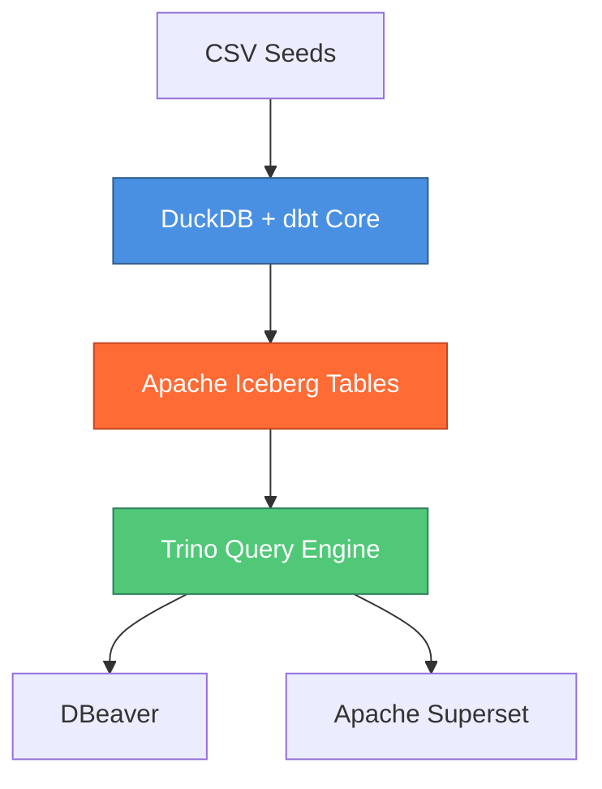
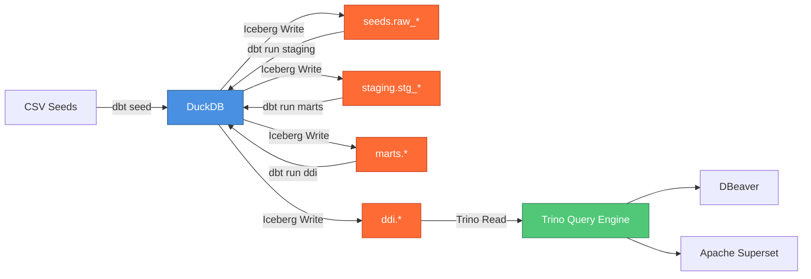

# DuckDB + Apache Iceberg Lakehouse Architecture Plan
## Jaffle Shop dbt Core Project Migration

**Project:** Migration from PostgreSQL to DuckDB + Apache Iceberg Lakehouse  
**Date:** 2026-01-09  
**Mode:** Architecture Design & Planning  
**Status:** Architecture Planning Phase

---

## Executive Summary

This document outlines the architectural design for migrating the Jaffle Shop dbt Core project from a PostgreSQL-based execution and storage model to a modern data lakehouse architecture using DuckDB as the compute engine and Apache Iceberg as the persistent storage layer. This migration establishes a decoupled architecture where DuckDB and Trino interact exclusively through the shared Iceberg table format, enabling scalable analytics while maintaining existing query tooling (DBeaver, Apache Superset) via Trino.

---

## Current Architecture Analysis

### Current State Components

**Execution Layer:**
- PostgreSQL serves as both compute engine and storage layer
- dbt Core uses [`dbt-postgres`](profiles.yml:5) adapter
- PostgreSQL manages all transformations for staging, marts, and DDI layers

**Storage Layer:**
- PostgreSQL native table format
- All tables (seeds, staging views, marts, DDI) stored in PostgreSQL
- Schema structure: [`dbt`](profiles.yml:11) schema with subschemas for staging, marts, ddi

**Query Layer:**
- Trino connects via [`jaffle_postgres.properties`](trino/etc/catalog/jaffle_postgres.properties:1) PostgreSQL connector
- Trino provides query federation capability
- DBeaver and Apache Superset consume via Trino

**Data Ingestion:**
- Three CSV seed files: [`raw_customers.csv`](seeds/raw_customers.csv:1), [`raw_orders.csv`](seeds/raw_orders.csv:1), [`raw_payments.csv`](seeds/raw_payments.csv:1)
- Loaded using [`dbt seed`](dbt_project.yml:9) command

### Current Limitations

1. **Tight Coupling:** PostgreSQL combines compute and storage, limiting horizontal scalability
2. **Single Engine Lock-in:** All processing must occur within PostgreSQL
3. **Limited Format Flexibility:** Proprietary PostgreSQL storage format
4. **Scalability Constraints:** Vertical scaling limitations for large datasets

---

## Target Lakehouse Architecture

### Architecture Principles

1. **Separation of Compute and Storage:** DuckDB handles computation; Iceberg handles persistence
2. **Open Table Format:** Apache Iceberg provides engine-agnostic storage
3. **Loose Coupling:** DuckDB and Trino remain independent, communicating only via Iceberg
4. **Backward Compatibility:** Existing Trino consumers (DBeaver, Superset) operate without changes

### Target Components



**Execution Engine:**
- DuckDB replaces PostgreSQL as compute engine
- In-process analytical database optimized for OLAP workloads
- No persistent server process required

**Storage Layer:**
- Apache Iceberg becomes the system of record
- Open table format with ACID guarantees
- Schema evolution, time travel, and partition management capabilities
- File-based storage (Parquet) with metadata layer

**Query Layer:**
- Trino accesses Iceberg tables directly via Iceberg connector
- No direct connection to DuckDB
- Existing client connections remain unchanged

---

## 1. System of Record Definition

### The New System of Record: Apache Iceberg

In the target lakehouse architecture, **Apache Iceberg becomes the authoritative system of record**, fundamentally shifting the data persistence paradigm from a database-centric model to a lakehouse-centric model.

#### Core Characteristics

**Persistent Storage Layer:**
- Iceberg tables stored as Parquet files with Iceberg metadata manifests
- Metadata tracks table schema, partitioning, snapshots, and file locations
- Storage location: Local filesystem or object storage (S3, MinIO, Azure Blob, GCS)

**ACID Guarantees:**
- Serializable isolation for concurrent reads and writes
- Atomic commits ensure data consistency
- Snapshot isolation enables time-travel queries

**Schema as Code:**
- Table schemas defined in Iceberg metadata
- Schema evolution tracked through metadata versioning
- Column additions, deletions, and type changes supported

**Decoupling Storage from Compute:**
- DuckDB writes Iceberg tables during dbt transformations
- Trino reads Iceberg tables for querying
- Future engines (Spark, Flink, Presto) can access same tables without migration

#### Storage Layer Role

The Iceberg storage layer functions as:

1. **Single Source of Truth:** All transformed data persists in Iceberg format
2. **Metadata Repository:** Tracks schema versions, snapshots, partition statistics
3. **File Manager:** Organizes Parquet data files with manifest files
4. **Isolation Boundary:** Separates DuckDB write operations from Trino read operations

#### Comparison to Previous Architecture

| Aspect | PostgreSQL (Previous) | Iceberg (Target) |
|--------|----------------------|------------------|
| Storage Format | Proprietary PostgreSQL format | Open Parquet + Iceberg metadata |
| Compute Coupling | Tightly coupled | Fully decoupled |
| Multi-Engine Access | Via network protocols | Direct file access |
| Schema Evolution | ALTER TABLE operations | Metadata-driven evolution |
| Time Travel | Limited via WAL | Native snapshot support |
| Scalability | Vertical (instance size) | Horizontal (file-based) |

---

## 2. dbt Profile Configuration

### DuckDB Adapter with Iceberg Extension

The [`profiles.yml`](profiles.yml:1) configuration requires replacement of the PostgreSQL adapter with the DuckDB adapter, along with Iceberg-specific extensions and connection parameters.

#### High-Level Configuration Structure

```yaml
jaffle_shop:
  target: dev
  outputs:
    dev:
      type: duckdb
      path: /path/to/duckdb/warehouse.db
      extensions:
        - iceberg
        - httpfs
      threads: 4
      settings:
        extension_directory: /path/to/extensions
        enable_external_access: true
```

#### Key Configuration Parameters

**Adapter Type:**
- Parameter: [`type`](profiles.yml:5)
- Value: `duckdb` (replaces `postgres`)
- Purpose: Instructs dbt to use DuckDB adapter

**Database Path:**
- Parameter: `path`
- Value: Filesystem path to DuckDB database file
- Consideration: Can be in-memory (`:memory:`) or persistent file
- Recommendation: Use persistent file for metadata tracking

**Iceberg Extension:**
- Parameter: `extensions`
- Value: `['iceberg']`
- Purpose: Loads DuckDB Iceberg extension for reading/writing Iceberg tables
- Note: May require additional configuration for Iceberg catalog location

**HTTP Filesystem Extension:**
- Parameter: `extensions`
- Value: `['httpfs']` (if using S3/object storage)
- Purpose: Enables S3-compatible object storage access
- Configuration: Requires AWS credentials or S3-compatible endpoint settings

**Thread Configuration:**
- Parameter: [`threads`](profiles.yml:12)
- Value: `4` (can be adjusted based on workload)
- Purpose: Controls parallelism for dbt model execution

**Additional Settings:**
- `extension_directory`: Location for DuckDB extensions
- `enable_external_access`: Permits external network access for extensions
- `s3_access_key_id`, `s3_secret_access_key`: If using S3 storage
- `s3_endpoint`: For S3-compatible storage (MinIO, LocalStack)

#### Iceberg Catalog Configuration

DuckDB's Iceberg extension requires catalog metadata configuration:

**Catalog Type Options:**
1. **Filesystem Catalog:** Metadata stored in local filesystem or object storage
2. **Hive Metastore Catalog:** Integration with Hive Metastore (requires compatibility layer)
3. **REST Catalog:** REST-based catalog service (future consideration)

**Recommended Approach for Initial Migration:**
- Use filesystem-based Iceberg catalog
- Store metadata in shared directory accessible by both DuckDB and Trino
- Example path: `/data/iceberg-warehouse/metadata`

#### Profile Configuration Example Structure

```yaml
jaffle_shop:
  target: dev
  outputs:
    dev:
      type: duckdb
      path: /data/duckdb/jaffle_shop.db
      extensions:
        - iceberg
        - httpfs
      threads: 4
      settings:
        s3_region: us-east-1
        s3_endpoint: localhost:9000
        s3_access_key_id: minioadmin
        s3_secret_access_key: minioadmin
        s3_use_ssl: false
        iceberg_catalog_path: /data/iceberg-warehouse
```

#### Dependencies Update

The [`requirements.txt`](requirements.txt:1) must be updated:

**Remove:**
- [`dbt-postgres==1.9.0`](requirements.txt:2)
- [`psycopg2-binary`](requirements.txt:3)

**Add:**
- `dbt-duckdb` (DuckDB adapter)
- Potential additional dependencies for Iceberg extension

**Installation Command:**
```bash
uv pip install dbt-duckdb
```

---

## 3. Materialization Strategy

### Iceberg Table Materialization Configuration

All dbt models must be configured to write Iceberg tables instead of default DuckDB tables. This requires adjustments in [`dbt_project.yml`](dbt_project.yml:1) and potentially model-specific config blocks.

#### Current Materialization Configuration

From [`dbt_project.yml`](dbt_project.yml:25-47):
- **Staging models:** [`+materialized: view`](dbt_project.yml:35)
- **Marts models:** [`+materialized: table`](dbt_project.yml:40)
- **DDI models:** [`+materialized: table`](dbt_project.yml:44)

#### Iceberg Materialization Approach

**Option 1: Global Iceberg Table Format Configuration**

Add global table format configuration in [`dbt_project.yml`](dbt_project.yml:1):

```yaml
models:
  jaffle_shop:
    +persist_docs:
      relation: true
      columns: true
    +table_format: iceberg
    +iceberg_location: /data/iceberg-warehouse/jaffle_shop
    staging:
      +schema: staging
      +materialized: table  # Changed from view
      +table_format: iceberg
    marts:
      +schema: marts
      +materialized: table
      +table_format: iceberg
    ddi:
      +schema: ddi
      +materialized: table
      +table_format: iceberg
```

**Key Changes:**
1. **Staging Layer:** Changed from view to table materialization (Iceberg does not support views as persistent objects)
2. **Table Format Parameter:** Added `+table_format: iceberg` directive
3. **Location Parameter:** Specified Iceberg warehouse location

**Option 2: DuckDB-Specific CREATE TABLE Syntax**

Leverage DuckDB's Iceberg table creation syntax within model configurations:

```yaml
models:
  jaffle_shop:
    staging:
      +materialized: table
      +pre-hook: |
        CREATE OR REPLACE TABLE {{ this }} AS (
          SELECT * FROM {{ ref('source_model') }}
        ) USING ICEBERG
        LOCATION '/data/iceberg-warehouse/jaffle_shop/staging/{{ this.name }}'
```

#### Handling Seeds (CSV Ingestion)

CSV seed data from [`seeds/`](seeds/raw_customers.csv:1) directory must be loaded into Iceberg tables:

**Approach:**
1. Load seeds using `dbt seed` command (DuckDB creates temporary tables)
2. Post-seed hook converts temporary tables to Iceberg format
3. Staging models reference Iceberg-formatted seed tables

**Configuration:**
```yaml
seeds:
  jaffle_shop:
    +schema: seeds
    +table_format: iceberg
    +post-hook: |
      ALTER TABLE {{ this }} 
      SET TBLPROPERTIES (format='iceberg')
```

#### Incremental Model Considerations

For incremental models (if present), Iceberg provides native merge capabilities:

**Iceberg Merge Syntax:**
- Use `MERGE INTO` statements for incremental updates
- Iceberg tracks file-level changes for efficient merges
- Time-travel capabilities enable incremental model debugging

**Configuration:**
```yaml
models:
  jaffle_shop:
    incremental_model:
      +materialized: incremental
      +table_format: iceberg
      +unique_key: id
      +incremental_strategy: merge
```

#### Schema Contract Preservation

Existing schema contracts defined in [`models/marts/schema.yml`](models/marts/schema.yml:1) and [`models/ddi/schema.yml`](models/ddi/schema.yml:1) must be preserved:

- Data types mapped from PostgreSQL to DuckDB equivalents
- Constraints (not null, unique) translated to Iceberg schema definitions
- Documentation metadata persisted in Iceberg table properties

---

## 4. Trino Configuration

### Iceberg Catalog Connector Setup

Trino must be configured to replace the PostgreSQL connector with an Iceberg catalog connector, enabling direct reads from Iceberg tables written by DuckDB.

#### Current Trino Configuration

From [`trino/etc/catalog/jaffle_postgres.properties`](trino/etc/catalog/jaffle_postgres.properties:1):
```properties
connector.name=postgresql
connection-url=jdbc:postgresql://postgres:5432/dbt
connection-user=trino_user
connection-password=trino_pass
```

#### Target Iceberg Catalog Configuration

Create new catalog file: [`trino/etc/catalog/jaffle_iceberg.properties`](trino/etc/catalog/jaffle_iceberg.properties:1)

**Configuration Structure:**
```properties
connector.name=iceberg
iceberg.catalog.type=filesystem
iceberg.file-format=PARQUET
fs.native-s3.enabled=true
s3.endpoint=http://localhost:9000
s3.path-style-access=true
s3.aws-access-key=minioadmin
s3.aws-secret-key=minioadmin
```

#### Catalog Type Configuration

**Filesystem Catalog (Recommended for initial migration):**
```properties
connector.name=iceberg
iceberg.catalog.type=filesystem
iceberg.catalog.warehouse=/data/iceberg-warehouse
```

**Parameters:**
- `iceberg.catalog.type`: `filesystem` (simplest approach)
- `iceberg.catalog.warehouse`: Base path to Iceberg warehouse directory
- Must match the warehouse path used by DuckDB

**Alternative: Hive Metastore Catalog (for production):**
```properties
connector.name=iceberg
iceberg.catalog.type=hive_metastore
hive.metastore.uri=thrift://metastore:9083
```

**Parameters:**
- `iceberg.catalog.type`: `hive_metastore`
- `hive.metastore.uri`: Thrift URI for Hive Metastore service
- Requires deploying Hive Metastore service

#### Object Storage Configuration

If using S3-compatible storage (MinIO, LocalStack):

```properties
connector.name=iceberg
iceberg.catalog.type=filesystem
iceberg.catalog.warehouse=s3://jaffle-iceberg-warehouse/
s3.endpoint=http://minio:9000
s3.path-style-access=true
s3.aws-access-key=minioadmin
s3.aws-secret-key=minioadmin
s3.region=us-east-1
```

**Key Parameters:**
- `s3.endpoint`: MinIO or LocalStack endpoint
- `s3.path-style-access`: Required for non-AWS S3 implementations
- `s3.aws-access-key`, `s3.aws-secret-key`: S3 credentials

#### Schema Mapping

Trino schemas must map to Iceberg namespaces:

| dbt Schema | Iceberg Namespace | Trino Schema |
|------------|-------------------|--------------|
| staging | jaffle_shop.staging | jaffle_iceberg.staging |
| marts | jaffle_shop.marts | jaffle_iceberg.marts |
| ddi | jaffle_shop.ddi | jaffle_iceberg.ddi |
| seeds | jaffle_shop.seeds | jaffle_iceberg.seeds |

**Query Example:**
```sql
-- Previous PostgreSQL-based query
SELECT * FROM jaffle_postgres.dbt.marts_customers;

-- New Iceberg-based query
SELECT * FROM jaffle_iceberg.marts.customers;
```

#### Docker Compose Integration

Update [`docker-compose.yml`](docker-compose.yml:36) to remove PostgreSQL dependency and ensure Trino volume mounts include new Iceberg catalog:

```yaml
trino:
  image: trinodb/trino:latest
  container_name: trino
  ports:
    - "8080:8080"
  environment:
    - DISCOVERY_URI=http://trino:8080
  volumes:
    - ./trino/etc:/etc/trino
    - /data/iceberg-warehouse:/data/iceberg-warehouse:ro
```

**Key Changes:**
1. Remove `depends_on: postgres` dependency
2. Add read-only volume mount to Iceberg warehouse
3. Ensure Trino can access Iceberg metadata and data files

#### Superset Connection Update

Apache Superset connection string in [`docker-compose.yml`](docker-compose.yml:20) requires update to point to Trino with Iceberg catalog:

**Previous:**
```
trino://admin@trino:8080/jaffle_postgres
```

**New:**
```
trino://admin@trino:8080/jaffle_iceberg
```

---

## 5. Data Flow Narrative

### End-to-End Data Lifecycle Walkthrough

This section provides a detailed step-by-step architectural walkthrough of how data flows through the new lakehouse architecture, from CSV ingestion to end-user consumption.

#### Phase 1: CSV Seed Ingestion

**Step 1.1: Seed File Preparation**
- CSV files located in [`seeds/`](seeds/raw_customers.csv:1) directory
- Files: [`raw_customers.csv`](seeds/raw_customers.csv:1), [`raw_orders.csv`](seeds/raw_orders.csv:1), [`raw_payments.csv`](seeds/raw_payments.csv:1)
- dbt Core identifies seed files based on [`seed-paths`](dbt_project.yml:9) configuration

**Step 1.2: DuckDB Seed Loading**
- Command executed: `dbt seed --profiles-dir . --target dev`
- DuckDB adapter reads CSV files into memory
- Initial loading creates DuckDB transient tables in `seeds` schema

**Step 1.3: Iceberg Conversion**
- Post-seed hook (if configured) converts transient tables to Iceberg format
- DuckDB Iceberg extension invoked with `CREATE TABLE ... USING ICEBERG` syntax
- Writes Parquet data files to `/data/iceberg-warehouse/jaffle_shop/seeds/`
- Generates Iceberg metadata manifests (`.metadata/` directory)
- Registers table schema in Iceberg catalog (filesystem or Hive Metastore)

**Output:**
- Iceberg tables: `seeds.raw_customers`, `seeds.raw_orders`, `seeds.raw_payments`
- Storage location: `/data/iceberg-warehouse/jaffle_shop/seeds/{table_name}/`
- Metadata files: `metadata/version-hint.text`, `metadata/snap-{id}.avro`

#### Phase 2: DuckDB Staging Layer Processing

**Step 2.1: Staging Model Compilation**
- dbt parses staging models: [`stg_customers.sql`](models/staging/stg_customers.sql:1), [`stg_orders.sql`](models/staging/stg_orders.sql:1), [`stg_payments.sql`](models/staging/stg_payments.sql:1)
- Jinja templating resolves `{{ ref('raw_customers') }}` to Iceberg seed table reference
- SQL compilation generates DuckDB-compatible queries

**Step 2.2: DuckDB Execution**
- Command executed: `dbt run --profiles-dir . --target dev --select staging`
- DuckDB reads Iceberg seed tables using Iceberg extension
- Applies transformations (column renaming, filtering, type casting)
- Query execution occurs in-memory within DuckDB process

**Step 2.3: Iceberg Write**
- Changed materialization from view to table (Iceberg requirement)
- DuckDB writes transformed data as Iceberg tables
- Parquet files written to `/data/iceberg-warehouse/jaffle_shop/staging/{table_name}/data/`
- Iceberg metadata updated with new snapshot
- Snapshot metadata includes partition information, file manifests, schema version

**Output:**
- Iceberg tables: `staging.stg_customers`, `staging.stg_orders`, `staging.stg_payments`
- Each table has independent snapshot history
- Schema registered in Iceberg catalog with column-level metadata

#### Phase 3: Marts Layer Processing

**Step 3.1: Mart Model Compilation**
- dbt parses mart models: [`customers.sql`](models/marts/customers.sql:1), [`orders.sql`](models/marts/orders.sql:1)
- Resolves `{{ ref('stg_customers') }}` to staging Iceberg table references
- Generates complex JOIN and aggregation queries

**Step 3.2: DuckDB Execution**
- Command: `dbt run --profiles-dir . --target dev --select marts`
- DuckDB reads staging Iceberg tables via Iceberg extension
- Performs joins between staging tables (customers, orders, payments)
- Executes aggregations (customer lifetime value, order counts)
- In-memory processing leverages DuckDB's columnar engine

**Step 3.3: Iceberg Write**
- Writes final mart tables as Iceberg format
- Location: `/data/iceberg-warehouse/jaffle_shop/marts/{table_name}/`
- Iceberg maintains ACID guarantees during write
- Atomic commit ensures partial writes are not visible

**Output:**
- Iceberg tables: `marts.customers`, `marts.orders`
- Optimized Parquet files with column statistics
- Metadata includes partition keys, sort orders

#### Phase 4: DDI Layer Processing

**Step 4.1: DDI Model Compilation**
- dbt parses DDI models: [`at_risk_customers.sql`](models/ddi/at_risk_customers.sql:1), [`rolling_30_day_orders.sql`](models/ddi/rolling_30_day_orders.sql:1)
- References both staging and marts tables
- Applies business logic (at-risk customer identification, rolling windows)

**Step 4.2: DuckDB Execution**
- Command: `dbt run --profiles-dir . --target dev --select ddi`
- Reads from staging and marts Iceberg tables
- Performs date arithmetic and window functions
- Filters customers based on activity thresholds

**Step 4.3: Iceberg Write**
- Writes DDI insights as Iceberg tables
- Location: `/data/iceberg-warehouse/jaffle_shop/ddi/{table_name}/`
- Tables optimized for analytical queries

**Output:**
- Iceberg tables: `ddi.at_risk_customers`, `ddi.rolling_30_day_orders`
- Ready for consumption by query engines

#### Phase 5: Trino Query Access

**Step 5.1: Trino Catalog Discovery**
- Trino service starts with Iceberg catalog configuration
- Reads Iceberg catalog metadata from `/data/iceberg-warehouse/jaffle_shop/`
- Discovers namespaces: `seeds`, `staging`, `marts`, `ddi`
- Registers tables with Trino metadata

**Step 5.2: Query Execution Flow**
- User executes query via DBeaver or Superset: `SELECT * FROM jaffle_iceberg.marts.customers;`
- Trino coordinator parses query and identifies Iceberg table
- Trino Iceberg connector reads Iceberg metadata manifests
- Determines which Parquet files contain relevant data
- Workers read Parquet files directly from filesystem/object storage
- Applies predicates and projections at file level (Parquet pushdown)

**Step 5.3: Result Delivery**
- Trino workers stream results to coordinator
- Coordinator returns results to client (DBeaver/Superset)
- No interaction with DuckDB during query execution

**Key Isolation Point:**
- DuckDB and Trino never communicate directly
- Both engines read/write Iceberg format independently
- Iceberg metadata ensures consistency and snapshot isolation

#### Phase 6: End-User Consumption

**Step 6.1: DBeaver Access**
- User connects to Trino via JDBC: `jdbc:trino://localhost:8080/jaffle_iceberg`
- Executes ad-hoc SQL queries against marts and DDI tables
- Receives real-time results from Iceberg tables

**Step 6.2: Apache Superset Access**
- Superset connects to Trino via SQLAlchemy: `trino://admin@trino:8080/jaffle_iceberg`
- Dashboard queries execute against Iceberg tables
- Visualizations render data from DDI and marts layers
- No changes required to existing dashboard configurations (only connection string update)

**Step 6.3: Concurrent Access**
- Multiple users query via Trino simultaneously
- Iceberg's snapshot isolation ensures consistent reads
- DuckDB can write new snapshots without blocking Trino reads
- Trino queries always read from committed snapshots

#### Data Lineage Flow



#### Isolation and Decoupling

**Write Path (DuckDB):**
1. DuckDB executes dbt transformations
2. Writes Iceberg tables to shared storage
3. Commits Iceberg snapshots atomically
4. DuckDB process terminates after dbt run completion

**Read Path (Trino):**
1. Trino connects to Iceberg catalog
2. Reads latest committed snapshots
3. Executes queries without DuckDB involvement
4. Serves results to end users

**Critical Separation:**
- No network communication between DuckDB and Trino
- No shared memory or processes
- Only shared artifact: Iceberg metadata and Parquet files
- Enables independent scaling and deployment

---

## 6. Deployment and Validation Approach

### Implementation Phases

**Phase 1: Environment Setup**
1. Install DuckDB CLI and verify Iceberg extension availability
2. Configure shared Iceberg warehouse directory (`/data/iceberg-warehouse`)
3. Update Python dependencies in [`venv`](requirements.txt:1) using `uv pip`
4. Remove PostgreSQL container from [`docker-compose.yml`](docker-compose.yml:4)

**Phase 2: dbt Profile Migration**
1. Backup existing [`profiles.yml`](profiles.yml:1)
2. Create new DuckDB profile with Iceberg extension configuration
3. Test connectivity: `dbt debug --profiles-dir .`
4. Validate extension loading

**Phase 3: Seed Migration**
1. Execute `dbt seed` with DuckDB profile
2. Verify Iceberg table creation in warehouse directory
3. Inspect metadata files and Parquet data files
4. Validate row counts and schema definitions

**Phase 4: Model Migration**
1. Execute `dbt run --select staging` to migrate staging layer
2. Execute `dbt run --select marts` to migrate marts layer
3. Execute `dbt run --select ddi` to migrate DDI layer
4. Validate Iceberg table properties and snapshots

**Phase 5: Trino Integration**
1. Create new Iceberg catalog configuration: [`jaffle_iceberg.properties`](trino/etc/catalog/jaffle_iceberg.properties:1)
2. Restart Trino service: `podman restart trino`
3. Test catalog discovery: `SHOW SCHEMAS FROM jaffle_iceberg;`
4. Validate table reads: `SELECT * FROM jaffle_iceberg.marts.customers LIMIT 10;`

**Phase 6: End-User Validation**
1. Update DBeaver connection string to Trino Iceberg catalog
2. Update Superset data source connections
3. Execute validation queries against all layers
4. Verify dashboard functionality in Superset

### Validation Queries

**Iceberg Metadata Inspection:**
```sql
-- View table snapshots
SELECT * FROM jaffle_iceberg.marts."customers$snapshots";

-- View table history
SELECT * FROM jaffle_iceberg.marts."customers$history";

-- View table files
SELECT * FROM jaffle_iceberg.marts."customers$files";
```

**Data Quality Validation:**
```sql
-- Compare row counts
SELECT COUNT(*) FROM jaffle_iceberg.marts.customers;

-- Validate joins
SELECT 
    c.customer_id,
    c.customer_lifetime_value,
    COUNT(o.order_id) as order_count
FROM jaffle_iceberg.marts.customers c
LEFT JOIN jaffle_iceberg.marts.orders o
    ON c.customer_id = o.customer_id
GROUP BY c.customer_id, c.customer_lifetime_value;
```

### Rollback Strategy

In case of migration issues:

1. **Profile Rollback:** Restore [`profiles.yml`](profiles.yml:1) from backup
2. **Service Rollback:** Restore PostgreSQL container in [`docker-compose.yml`](docker-compose.yml:4)
3. **Trino Rollback:** Restore [`jaffle_postgres.properties`](trino/etc/catalog/jaffle_postgres.properties:1)
4. **Data Validation:** Verify PostgreSQL data integrity before resuming operations

### Performance Benchmarking

**Metrics to Capture:**
1. dbt run execution time (before vs. after)
2. Query response time in Trino (before vs. after)
3. Storage footprint (PostgreSQL tables vs. Iceberg Parquet files)
4. Concurrent query performance

---

## 7. Operational Considerations

### Storage Management

**Iceberg Warehouse Structure:**
```
/data/iceberg-warehouse/
├── jaffle_shop/
│   ├── seeds/
│   │   ├── raw_customers/
│   │   │   ├── data/
│   │   │   │   └── 00000-0-*.parquet
│   │   │   └── metadata/
│   │   │       ├── version-hint.text
│   │   │       └── snap-*.avro
│   │   ├── raw_orders/
│   │   └── raw_payments/
│   ├── staging/
│   │   ├── stg_customers/
│   │   ├── stg_orders/
│   │   └── stg_payments/
│   ├── marts/
│   │   ├── customers/
│   │   └── orders/
│   └── ddi/
│       ├── at_risk_customers/
│       └── rolling_30_day_orders/
```

**Storage Cleanup:**
- Iceberg snapshot expiration for old data versions
- Orphan file removal (data files not referenced by metadata)
- Compaction of small Parquet files

### Monitoring and Observability

**Key Metrics:**
1. Iceberg snapshot count per table
2. Parquet file count and size distribution
3. Metadata file growth
4. Trino query latency on Iceberg tables
5. DuckDB dbt run success rate

**Logging:**
- DuckDB execution logs (dbt logs in `logs/` directory)
- Trino query logs (Iceberg connector logs)
- Iceberg metadata operation logs

### Security Considerations

**Access Control:**
1. **Filesystem Permissions:** Restrict read/write access to Iceberg warehouse
2. **Object Storage IAM:** Configure S3 bucket policies if using cloud storage
3. **Trino Authentication:** Enable authentication for Trino queries
4. **Superset RBAC:** Configure row-level security in Superset

**Data Encryption:**
1. Encryption at rest for Parquet files
2. TLS for Trino client connections
3. Secrets management for S3 credentials

---

## 8. Future Enhancements

### Advanced Iceberg Features

**Time Travel Queries:**
- Query historical snapshots: `SELECT * FROM table FOR VERSION AS OF {snapshot_id}`
- Enable point-in-time analysis and auditing

**Partition Evolution:**
- Modify partitioning strategy without rewriting data
- Optimize query performance based on access patterns

**Schema Evolution:**
- Add, remove, or modify columns without downtime
- Maintain backward compatibility with existing queries

### Multi-Engine Integration

**Apache Spark:**
- Read Iceberg tables for large-scale ML feature engineering
- Write batch transformations back to Iceberg

**Apache Flink:**
- Stream real-time data into Iceberg tables
- Enable near-real-time analytics in Trino

### Advanced Materialization Strategies

**Incremental Models:**
- Leverage Iceberg merge capabilities for efficient incremental updates
- Reduce reprocessing overhead for large fact tables

**Materialized Views:**
- Pre-aggregate data for common query patterns
- Automatically refresh on upstream table changes

---

## Conclusion

This architectural design establishes a modern data lakehouse foundation for the Jaffle Shop dbt project, decoupling compute (DuckDB) from storage (Apache Iceberg) while maintaining seamless query access via Trino. The migration preserves existing query tooling (DBeaver, Apache Superset) while unlocking scalability, multi-engine support, and advanced Iceberg capabilities.

The architecture adheres to lakehouse principles of open formats, engine independence, and ACID guarantees, positioning the platform for future growth and integration with additional compute engines (Spark, Flink) without requiring data migration.

**Key Success Factors:**
1. Proper Iceberg catalog configuration alignment between DuckDB and Trino
2. Thorough testing of dbt model materializations as Iceberg tables
3. Validation of snapshot isolation and concurrent access patterns
4. Performance benchmarking to ensure query latency meets SLAs

---

## Next Steps

1. Review this architectural plan and provide feedback
2. Clarify any configuration details or requirements
3. Approve plan before proceeding to implementation phase
4. Switch to Code mode for implementation once plan is approved

**Dependencies:**
- DuckDB with Iceberg extension support (verify compatibility)
- Trino version with Iceberg connector (latest recommended)
- Shared filesystem or object storage for Iceberg warehouse
- Updated Python dependencies in virtual environment

---

**Document Version:** 1.0  
**Last Updated:** 2026-01-09  
**Author:** Senior Data Architect AI  
**Status:** Awaiting Review and Approval
